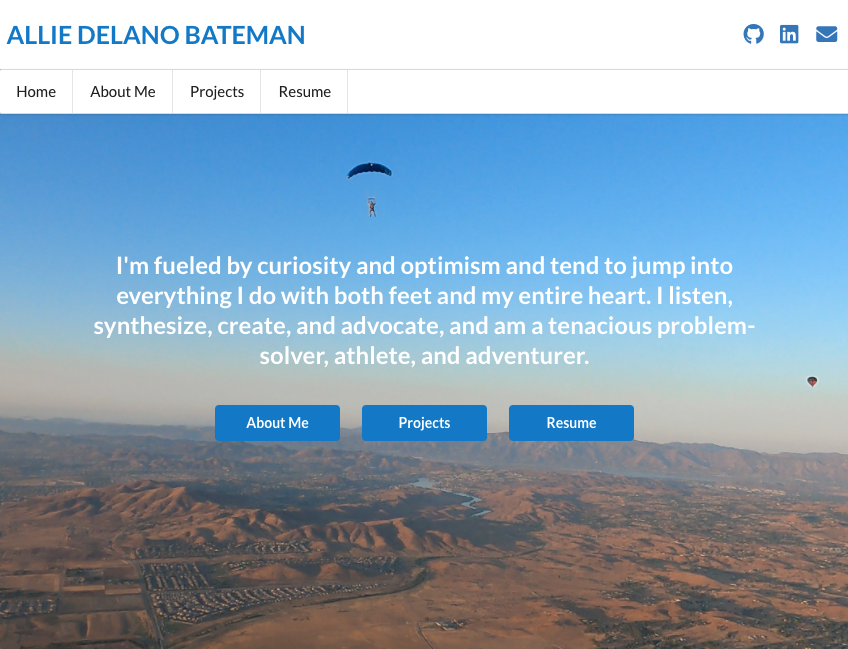

# My Portfolio
The goals of this portfolio are to tell the world who I am, showcase my work, and demonstrate some of my skills. It features a home page, an about me page with a short bio, a page displaying projects I've done, and my resume.  

## Technologies Used
* React
* Semantic UI React
* HTML/CSS/JavaScript
* I purposefully kept this site very simple for its first iteration by using a JavaScript file as the database for project details. That said, I also set up the foundation for the backend so I can easily turn my portfolio into a full MERN app down the road as my needs evolve.

## Check it Out
Check out my portfolio here: [Allie's Portfolio](https://alliedelano.herokuapp.com/)

## Next Steps
I anticipate that my needs will evolve as I continue building my business and developing new sites and apps for clients. A few features I may incorporate down the road include:
* Custom domain
* Embedded contact form
* Client feedback form
* Testimonials

